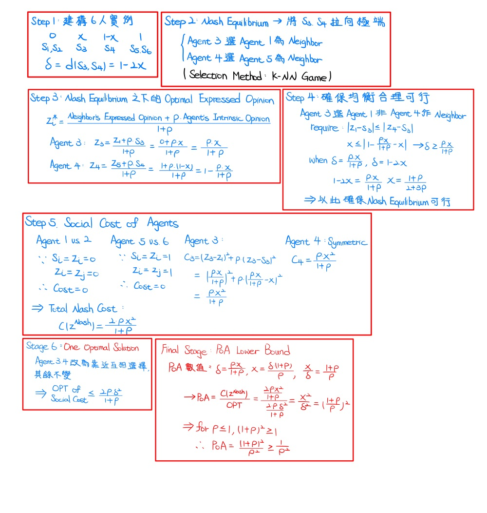

# Coevolutionary Opinion Formation Games

## 研究動機 + 核心概念

### 一、研究主題

Paper提出一個由 **社群網路的意見 (Opinions in Social Networks)** 所形成的博弈論模型 (Game-Theoretic Models)，研究意見 (Opinions) 和 Friendships 如何共同演化。

### 二、核心研究問題

#### 1. 個體如何選擇意見
- 具有固定 Intrinsic Opinions 的個體 A，會根據其他個體 Opinion，以及自身對該 Opinion 的信心，來選擇自己的 Expressed Opinion

#### 2. Social Network 如何形成
- Social Network 的形成取決於個體的 Expressed Opinion

### 三、理論基礎
  - Models 中的 Nodes 透過 **< Maximize 與朋友之間的意見一致性 >** 來形成自身 Opinion
  - 意見一致性取決於每個朋友間意見差異加權的關係強度
  - 透過概括 FOCS 2011 最新研究 – 有界信心模型 (Bounded Confidence Type Models)，來定義這一過程的均衡的社會成本
  - Bindel 等人透過考慮無政府狀態的代價 (Price of Anarchy, PoA)，來分析達到均衡時的品質

---

## Paper 分析方式

### 一、社會成本 (Social Cost)

- 衡量所有個體在均衡狀態下的總成本
- 包含：個體之間的 Expressed Opinion 差異成本 + 個體自身的 Intrinsic vs. Expressed Opinion 差異成本

### 二、無政府狀態的代價 (Price of Anarchy)

#### 1. 定義
$$
\text{PoA} = \frac{\text{均衡社會成本}}{\text{最適社會成本}} = \frac{\text{Cost of the Worst Equilibrium Outcome}}{\text{Optimal Social Outcome}}
$$

#### 2. 前提假設
- 假設個體 Intrinsic Opinion 皆固定，並且當下的 Optimal Social Outcome 被明確定義

---

## 三種 Equilibrium Solution 的概念

Paper 利用 3 種 Solution concept 定義 Equilibrium，再藉由 Equilibrium 集合計算 PoA，並且每種 Concept 限制都比前者寬鬆，所以能夠比較 Worst Equilibrium Outcome 和 Optimal Equilibrium Outcome 的差距

### A. Pure NE

#### 1. 定義

$$
\forall i, \forall z_i' \in Z_i : C_i(z_i^{\ast}, z_{-i}^{\ast}) \le C_i(z_i', z_{-i}^{\ast})
$$

- $z_{-i}^*$：個體的任何其他可能意見
- 在固定其他個體意見下，個體策略為純意見 (非隨機)

#### 2. 條件
- 個體任何其他可能的意見，都不會比當前的策略更好

### B. Mixed NE

#### 1. 定義

$$
\sigma_i \in \text{Distribution}(z_i)
$$

- 個體選擇意見的策略為機率分布 (非純意見)

#### 2. 條件

$$
\forall i, \forall z_i \in \text{support}(\sigma_i), \forall z_i' \in Z_i : \quad \mathbb{E}_{z_{-i} \sim \sigma_{-i}}[C_i(z_i, z_{-i})] \leq \mathbb{E}_{z_{-i} \sim \sigma_{-i}}[C_i(z_i', z_{-i})]
$$

- 個體之間的「策略獨立」，並且要求「實際會用到的策略」必須一樣好，代表社會成本：現在用的策略 ≤ 任何替代策略

#### C. Correlated Equilibrium (CE)

#### 1. 定義

$$
\sigma \in \Delta(Z_1 \times \cdots \times Z_n)
$$

- 先抽樣，再私下建議玩家採用特定策略

#### 2. 條件

$$
\forall i, \forall z_i \in \text{support}(\sigma), \forall z_i' \in Z_i : \quad \mathbb{E}_{z_{-i} \sim \sigma_{-i} \mid z_i}[C_i(z_i, z_{-i})] \leq \mathbb{E}_{z_{-i} \sim \sigma_{-i} \mid z_i}[C_i(z_i', z_{-i})]
$$

- 允許個體間「策略相關」，使用條件期望，讓個體知道自己被建議採用的情況下

### Pure NE vs. Mixed NE vs. Correlated Equilibrium 三者間關係

#### 1. 總結：Pure NE ⊆ Mixed NE ⊆ CE

- Pure NE 的 PoA → Upper Bound (最緊的上界)
- CE 的 PoA → Lower Bound (最寬鬆的下界)

#### 2. 關係證明：
- A. Pure NE ⊆ Mixed NE
  
$$
z_i^* \leftrightarrow \sigma_i = \delta_{z_i^*}
$$

- B. Mixed NE ⊆ Correlated Equilibrium
  
$$
\sigma = \prod_{i} \sigma_i \leftrightarrow \sigma_{-i \mid z_i} = \sigma_{-i}
$$

---

## 局部平滑性論證 (Local Smoothness Arguments)

### 一、核心目的

透過局部平滑性論證，來嚴格限制產生的 PoA，並作為以下依據：
1. 描述 Nodes 對自身 Intrinsic Opinions 的重視程度
2. 作為 Nodes 對和自身意見更一致朋友，給予更多權重依據的函數

### 二、核心不等式

#### 1. 前提假設
- 社會成本函數為連續且可微分

#### 2. 公式

$$
\sum_{i} \left[ C_i(z_i, z_{-i}) + (o_i - z_i) \cdot \frac{\partial}{\partial z_i} C_i(z_i, z_{-i}) \right] \leq \lambda \cdot C(o) + \mu \cdot C(z)
$$

- **左式：**
  - 個體如果改成社會最優策略的成本
  - $$o_i$$：個體 i 的最優策略
  - $$\frac{\partial}{\partial z_i} C_i$$：個體 i 往最優策略移動下，社會成本減少量

- **右式：**
  - $$C(o)$$：最優策略的社會成本
  - $$C(z)$$：目前策略的社會成本
  - λ, μ：權重常數

#### 3. 意義
- 個體的社會成本，能被「最優成本」與「目前成本」限制住

---

## 對稱模型 vs. 非對稱模型

- Paper 研究在 **對稱 vs. 非對稱模型** 之下，Opinion 和 Friendship 共同演化的博弈，並為兩種模型提供 PoA 的上下界限

## 對稱模型

### 一、社會成本分析

#### 1. 公式

$$
C_i(z_i, z_{-i}) = \sum_{j \in N(i)} f_{ij}(z_i - z_j) + w_i g_i(z_i - s_i)
$$

#### 2. 模型假設
- Social Network 是 **Fixed + Undirected**
- 權重函數 f,g 具有：convex, differentiable, symmetric 特性
- $$s_i$$：個體 i 的 Intrinsic Opinion
- $$z_i$$：個體 i 的 Expressed Opinion
- $$N(i)$$：個體 i 相鄰的所有節點 (Neighbors of i)

#### 3.成本函數解釋
- 第一項：個體 i  vs. 鄰居 Expressed Opinion 差異的成本
- 第二項：個體 i Intrinsic vs. Expressed Opinion 差異的成本

### 二、PoA 上下界分析

#### 1. 上界 (Robust Upper Bound)

$$
A_1 = \{ (\lambda, \mu) :
f(x) + 2y - x f'(x) \le \lambda f(y) + \mu f(x),
\ \forall x, y \ge 0
\}
$$

$$
A_2 = \{ (\lambda, \mu) :
g(u) + (v - u) g'(u) \le \lambda g(v) + \mu g(u),
\ \forall u, v \ge 0
\}
$$

- (集合 $ A_1 $：Neighbor Effect 函數 $ f \in \mathcal{F} $ 產生的 Constraintst
- (集合 $ A_2 $：Intrinsic Cost 函數 $ \in \mathcal{G} $ 產生的 Constraints)

局部平滑性不等式：

$$
\sum_{i=1}^{n} \left[ C_i(z_i, z_{-i}) + (o_i - z_i) \cdot \frac{\partial C_i(z_i, z_{-i})}{\partial z_i} \right] \leq \lambda \cdot C(o) + \mu \cdot C(z)
$$

從局部平滑性不等式可以推導出：

$$
\frac{\mathbb{E}_{z \sim \sigma}[C(z)]}{C(o)} \leq \frac{\lambda}{1 - \mu}
$$

定義 PoA 的上界函數：

$$
\zeta(\mathcal{F}, \mathcal{G}) =
\inf \{ \tfrac{\lambda}{1 - \mu} :
(\lambda, \mu) \in A_1 \cap A_2,\ \mu < 1 \}
$$

因此：

$$
\text{PoA} \leq \frac{\lambda}{1 - \mu}
$$

- For $(\lambda, \mu) = \left(1, \frac{1}{2}\right) \in A_1 \cap A_2$：

$$
\text{PoA} \leq \frac{1}{1 - \frac{1}{2}} = \frac{1}{\frac{1}{2}} = 2
$$

#### 2. 下界 (Tight Lower Bound)

##### < First Stage >
- 給定，

$$ \text{PoA Bound of } \frac{\lambda}{1-\mu} \text{ with } (\lambda, \mu) \in A_1 \cap A_2 $$

- 定義：

$$ \zeta_n = \min_{(\lambda, \mu) \in C_n} \frac{\lambda}{1-\mu} > 1 $$

  - 因為為函數所限制的平面，所定義的 Convex Region，因此，最小值落在邊界

##### < Second Stage >
when,

$$
\zeta_n > 1, \quad f \in \mathcal{F}, \quad g \in \mathcal{G}
$$

$$
f(x_1) + \frac{y_1 - x_1}{2} \cdot f'(x_1) = \lambda_n \cdot f(y_1) + \mu_n \cdot f(x_1)
$$

$$
g(x_2) + (y_2 - x_2) \cdot g'(x_2) = \lambda_n \cdot g(y_2) + \mu_n \cdot g(x_2)
$$

- 最小值發生在 f, g 的交界，對應的參數為 $$(x_1,y_1,f)$$ 和 $$(x_2,y_2,g)$$

- 同時，when $$w_1 = \frac{x_1}{y_1}$$ 和 $$w_2 = \frac{x_2}{y_2}$$，Satisfy $$(w_1 - 1)(w_2 - 1) \leq 0 $$

##### < Third Stage >

為了證明 Lower Bound = $$\frac{\lambda}{1-\mu}$$ 為 Tight，Paper 建構了 Game Instance，來使 PoA 接近該數值。

**Consider 具有 Intrinsic Opinions 的三個個體：**
- 設定三個個體的內在意見（Intrinsic Opinions）：

$$
s_1 = 0, \quad s_2 = 1, \quad s_3 = 2
$$

- 定義 Nash 均衡結果為

$$
z_1^* = \frac{(1-w_1)w_2}{w_2-w_1}, \quad z_2^* = 1, \quad z_3^* = 2 - \frac{(1-w_1)w_2}{w_2-w_1}
$$

- Social 最佳結果為

$$
o_1 = \frac{1-w_1}{w_2-w_1}, \quad o_2 = 1, \quad o_3 = 2 - \frac{1-w_1}{w_2-w_1}
$$

- 因此，透過選擇適當的權重 w 和函數 f、g (讓 Neighbor force = Intrinsic force)，確保每個個體一階微分，恰好符合 Pure NE 成立條件

- 由於 PoA 是「均衡解」與最優解的比值，所以需要證明 z 是均衡解，而選擇證明 Pure NE 是因為它是最強的 Lower Bound
  - (Pure NE ⊆ Mixed NE ⊆ CE)

##### < Fourth Stage >

- 同時，Game Instance 也滿足 f, g 函數的約束性，並且等式成立，因此，將所有個體的等式相加後，便能得到

$$
\text{PoA} = \frac{C(z^*)}{C(o)} = \frac{\lambda}{1-\mu}
$$

 - **Tight Lower Bound:**

$$
\text{PoA} \ge \dfrac{\lambda}{1-\mu}
$$

---

## 非對稱模型

### 一、社會成本分析

#### 1. 公式
$$
C_i(z_i, z_{-i}) = \sum_{j \in N(i)} (z_i - z_j)^2 + \rho K (z_i - s_i)^2
$$
#### 2. 模型假設

- Social Network 是 **Dynamic + Directed**
- $$ N(i) = \{ \text{K agents with smallest } |z_j - s_i| \} $$
- 引入參數 $$ \rho $$：作為自身 Opinion 的權重比例

#### 3. 成本函數解釋：
- $$ \rho $$ 大 → Narrow minded (目光狹隘，堅持己見)，個體的 Social Cost 下降
- $$ \rho $$ 小 → Broad minded (心胸開闊，容易受他人意見影響)

### 二、PoA 上下界分析

#### 1. 上界
$$
\text{PoA} \leq \frac{(7+\epsilon)(2+\epsilon)}{1+\epsilon} \quad \text{for } \rho = 1+\epsilon, \; \epsilon > 0
$$

- $$ \rho \to 1^+ $$：上界 $$ \to 14 $$
- $$ \rho \to \infty $$：上界 $$ \to 9 $$
- 為單調遞減 (ρ 越大，上界越小)

**Proof:**

##### < First Stage: 假設 z = s 情況 (表達意見 = 內在意見，代表所有個體都誠實表達) >

- For $\rho \geq 0$,

$$
Q(i) = \{ \text{K closest } s_j \text{ to } s_i \}
$$

$$
C(s) = \sum_{i} \sum_{j \in Q(i)} (s_j - s_i)^2
$$

$$
\text{OPT} \geq \frac{\rho}{\rho + 6} \cdot C(s)
$$

$$
\frac{C(s)}{\text{OPT}} \leq \frac{\rho + 6}{\rho} = 1 + \frac{6}{\rho}
$$

- OPT：為 Optimal Solution of 誠實策略
- $$ \rho = 1 $$：誠實策略之下，OPT 是近似 $$7^-$$
- $$ \rho \to \infty $$：誠實策略之下，OPT 是近似 $$1^+$$，為最優解

##### < Second Stage: 局部平滑性不等式 >

- For Fixed $j \in S(i)$：

$$
(z_i - z_j)^2 + (z_i - s_i)^2 + 2(s_i - z_i)(z_i - z_j) = (s_i - z_j)^2
$$

- Exists inequality function：

$$
\sum_{j \in S(i)} (z_i - z_j)^2 + (s_i - z_i) \sum_{j \in S(i)} 2(z_i - z_j) = \sum_{j \in S(i)} (s_i - z_j)^2 - \sum_{j \in S(i)} (s_i - z_i)^2
$$

##### < Third Stage: 利用 K-NN 性質 >

- $$ S(i) $$ 因為是 K 個最接近 $$ s_i $$ 的 $$ z_j $$
- $$ Q(i) $$ 是 K 個最接近 $$ s_i $$ 的 $$ s_j $$
- 所以

$$
\sum_{j \in S(i)} (s_i - z_j)^2 \leq \sum_{j \in Q(i)} (s_i - z_j)^2
$$

##### < Fourth Stage: 使用三角不等式 >

- 使用三角不等式：

$$
(a + b)^2 \leq (d^2 + 1) a^2 + \left(\frac{1}{d^2} + 1\right) b^2 \quad \text{for any } a, b, d \geq 0
$$

- 令 $a = s_i - s_j$，$b = s_j - z_j$，$d^2 = \frac{\rho - 1}{2}$

- 則：

$$
(s_i - z_j)^2 = (s_i - s_j + s_j - z_j)^2 \leq \left(1 + \frac{2}{\rho - 1}\right) (s_i - s_j)^2 + \frac{\rho + 1}{2} (s_j - z_j)^2
$$

##### < Fifth Stage: 每個 j 最多出現在 2K 個集合中 >

-因為 $$ s_j $$ 在實數線上，for any $$ s_j $$
  - 最多有 K 個 such that $s_i \leq s_j$ and $s_j \in Q(i)$
  - 最多有 K 個 such that $s_i > s_j$ and  $s_j \in Q(i)$
- 因此，總共最多 2K 個

$$
\sum_{i} \sum_{j \in Q(i)} (s_j - z_j)^2 \leq 2K \sum_{j} (s_j - z_j)^2 = 2K \sum_{j} (z_j - s_j)^2
$$

##### < Final Stage: 最終不等式 >

- Let：$1 + \frac{2}{\rho - 1}$

$$
1 + \frac{2}{\rho - 1} = 1 + \frac{2}{\epsilon} = \frac{\epsilon + 2}{\epsilon}
$$

$$
\rho + 1 = (1 + \epsilon) + 1 = 2 + \epsilon
$$

- Thus,

$$
\lambda = \frac{\epsilon + 2}{\epsilon}, \quad \mu = 0
$$

- Then, by combining factor from Lemma 4.2

$$
\text{PoA} \leq \frac{\rho + 6}{\rho} \cdot \frac{\lambda}{1 - \mu}
$$

$$
= \frac{\rho + 6}{\rho} \cdot \frac{\lambda}{1 - 0} = \frac{\rho + 6}{\rho} \cdot \lambda
$$

$$
\frac{\rho + 6}{\rho} = \frac{(1 + \epsilon) + 6}{1 + \epsilon} = \frac{7 + \epsilon}{1 + \epsilon}
$$

$$
\text{PoA} \leq \frac{7 + \epsilon}{1 + \epsilon} \cdot \frac{\epsilon + 2}{\epsilon} = \frac{(7 + \epsilon)(\epsilon + 2)}{(1 + \epsilon)\epsilon} \cdot \epsilon = \frac{(7 + \epsilon)(2 + \epsilon)}{1 + \epsilon}
$$

$$
\text{PoA} \leq \frac{(7 + \epsilon)(2 + \epsilon)}{1 + \epsilon}
$$

**補充：**
- 因為 Pure NE 可能不存在 (Proposition 4.1: 當 $$ s_1 = 0, \quad s_2 = \frac{1}{2}, \quad s_3 = 1 $$, and weight $$ \rho = 1 $$, Pure NE 不存在)，所以採用 Local Smoothness，來分析 Correlated Equilibrium

#### 2. 下界

$$
\text{PoA} \geq \frac{1}{\rho^2}
$$

**Proof:**

##### < 概念 >
1. 先找到一個壞的 Nash Equilibrium (成本高)
2. 再找到一個好的解 (接近最優，成本低)
3. 證明

$$
\text{PoA} = \frac{\text{Nash Equilibrium Cost}}{\text{Optimal Cost}} \geq \frac{1}{\rho^2}
$$

##### < 詳細證明過程 >

---

